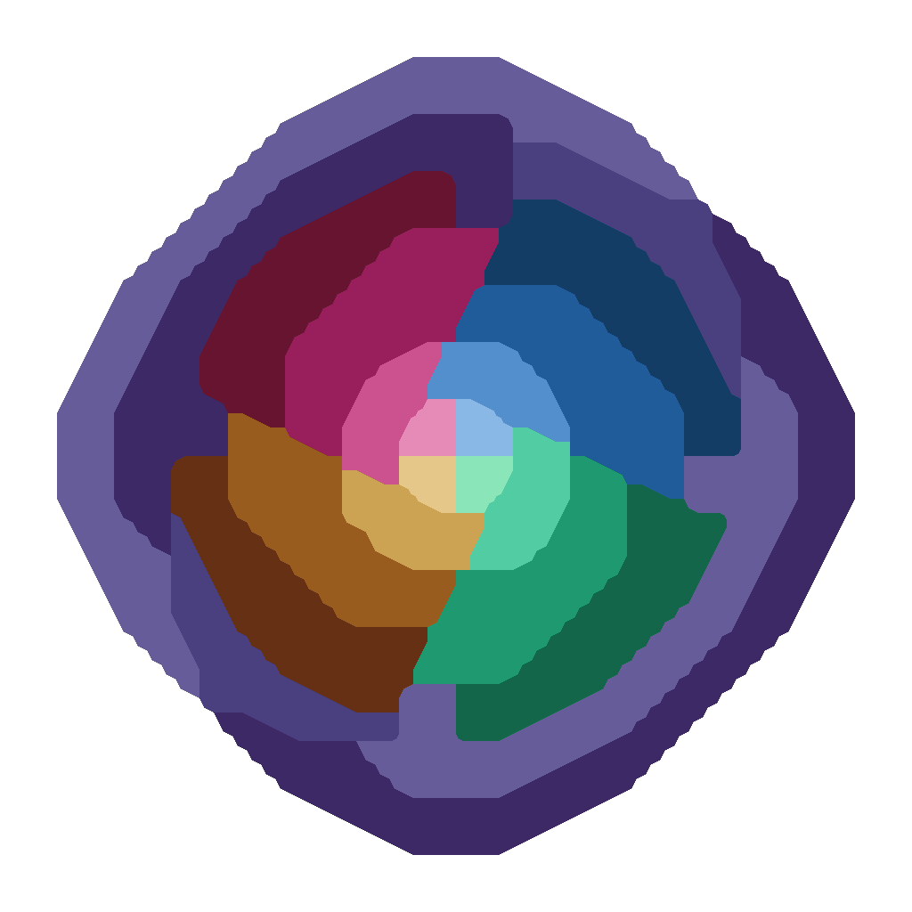

# Mau(no)bot

</img>

Бот позволяет вам играть в UNO со своими друзьями в Telegram чатах.
Игра реализована при помощи inline-query.

**Прочие возможности**:
- ⚙️ Система **лобби** для чата.
- 📝 **Журнал** игровых событий.
- 🎮 Множество режимов игры.
- 🪄 Callback кнопочки.

## Начало игры
Если вас заинтересовал проект, то давайте же сыграем вместе!

Бот находится здесь: [@maubot](https://t.me/mili_maubot).
Заодно можете подписаться на канал [Salormoon](https://t.me/mili_qlaster),
чтобы следить за обновлениями бота.

**Для того чтобы начать игру**:

1. Добавляем бота в чат с друзьями.
2. Вводим `/game` для создания нового лобби.
3. Когда все игроки присоединились, нажимаем начать. (`/start`)
4. Весело играем партию.
5. Ошалеваем от количества сообщений в чате.

## Режимы игры
Ранее мы упомянули о различных режимах игры.
Так вот, каждый из режимов привносит какую-то механику.
На данный момент доступно 10 режимов игры:

- **🐉 Дикие карты**: Меньше основных карт, больше козырных. Веселье начинается.
- **🤝 Обмен руками**: Каждый раз как вы выкидываете 2, вы обмениваетесь картами
  с другим игроком.
- **🧭 Обмен телами**: Каждый раз как кто-то выкидывает 0, все игроки
  обмениваются картами по кругу.
- **🍷 Беру до последнего**: Нету подходящей карты? Бери пока не появится.
- **🔫 Рулетка**: Не желаете брать карты, тогда выстрелите из револьвера.
  Если повезёт. брать будет уже следующий игрок.
- **🎲 Общий револьвер**: Похожа на рулетку, только револьвер один на всех.
- **🃏 самоцвет**: Для карт выбора цвета и +4 цвет выбирается по кругу.
- **🎨 Случайный цвет**: Для карты выбора цвета и +4 цвет выбирается случайно.
- **🎨 Какой цвет дальше**: На самом деле ваши карты совсем другого цвета.
- **🦝 Отладочные карты**: Полезно для разработчиков, набор всех нужных карт.

## Самостоятельная установка
Разумеется благодаря открытому коду вы можете запустить своего бота.
Или быть может сделать форк с добавлением новых функций.

Чтобы развернуть собственного бота.

1. Клонируем репозиторий при помощи `git`.
2. Устанавливаем зависимости при помощи `poetry install`.
3. Копируем файл с настройками `config.json.sample` в `config.json`.
4. Запускаем бота при помощи `poetry run python -m maubot`.

Вот и всё :)

Ах да, ещё вам потребуется включить `inline mode` для вашего бота и
обязательно выставить `inline feedback` на 100%.
Без этого, отправленные вами карты не будут обрабатываться ботом.

## Авторство
Изначально этот репозиторий был **форком**
[Mau Mau bot](https://github.com/jh0ker/mau_mau_bot).
Однако тут произошло насколько много изменений: переписан с нуля на
другой библиотеке, добавлено много режимов... стоит продолжать?

Теперь это самостоятельная разработка.
Кстати говоря, карточки для игры также были нарисованы самостоятельно.
Вы можете использовать их согласно следующей лицензии.

<a property="dct:title" rel="cc:attributionURL" href="http://codeberg.org/salormoon/maubot">Maubot uno cards</a> by <a rel="cc:attributionURL dct:creator" property="cc:attributionName" href="https://t.me/mili_qlaster">Milinuri Nirvalen</a> is licensed under <a href="https://creativecommons.org/licenses/by-nc-sa/4.0/?ref=chooser-v1" target="_blank" rel="license noopener noreferrer" style="display:inline-block;">CC BY-NC-SA 4.0</a>
 

## Поддержка
Мы будем очень рады, если вы поддержите развитие проекта.
Начиная с простой отметки звёздочкой, использованием бота и заканчивая
запросами на слияние.

Нам бы очень хотелось создать бота для весёлой совместной игры с друзьями.
