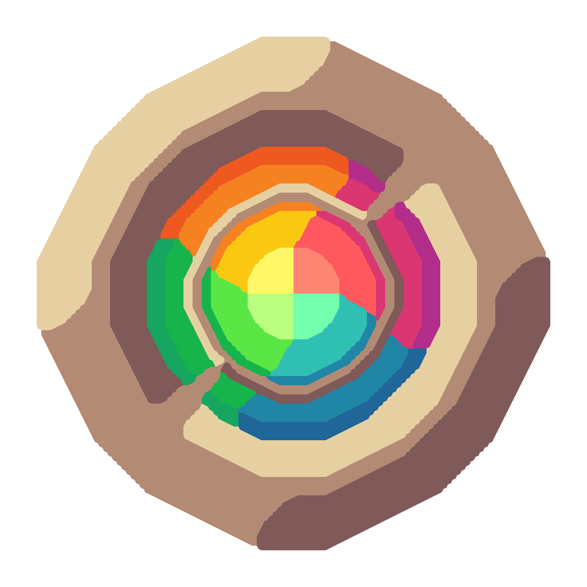

# Mau;engine

</img>

**Mauno** - минималистичный игровой движок _карточных игр_.
Как например _Mau_, только с добавлением дополнительных возможностей и правил.
Цель проекта - расширить горизонты карточных игр.

В этом проекте представлена реализация игрового движка, а также
документация к нему.
Если вас интересуют другие проекты семейства Mau, пролистайте ниже.

## Архитектура

Поговорим о компонентах. которые входят в **игровой движок**.
Движок старается быть минималистичным.
Потому с версии v3 было вырезано множество не обязательных компонентов.
Теперь они будут реализовываться на стороне **сервера** или же **клиента**.

### `mau`

Общие компоненты игрового движка.
Которые могут использоваться по всему проекту.

- `mau.enums`: Содержит `GameState` - текущее состояние игры.
- `mau.enums`: Интерфейс обработчика игровых события и перечисление всех событий.
- `mau.rules`: Реализация битовых игровых правил, меняющих ощущение игры.
- `mau.session`: Менеджер комнат, управляющий играми и игроками.
- `mau.settings`: Модель общих настроек для игровой сессии.

### `mau.deck`

Реализация Mau карт и колоды с картами.

- `mau.deck.behavior`: Функциональное поведение карты и события на действия.
- `mau.deck.card`: Реализация Mau карты.
- `mau.deck.deck`: Реализация колоды с картами.

> Начиная с версии `v3.3` из движка был вырезан генератор колоды.
> Теперь он реализуется на стороне сервера/клиента.

Вот что входит в движок Mau:

### `mau.game`

Непосредственно игровой процесс и связанные с ним компоненты.

- `mau.game.game`: Реализация игровой сессии и игрового процесса.
- `mau.game.player`: Реализация игрока с картами на руках.
- `mau.game.player_manager`: Менеджер игроков в рамках игровой сессии.
- `mau.game.shotgun`: Компонент револьвера для поднятия градуса игры.
- `mau.game.timer`: Игровой таймер для ограничения времени сессии.

## Семейство Mau

Для полноценной игры одного движка недостаточно.
Представляем вам проекты, которые дополняют игровой движок.

- [Cards](https://git.miroq.ru/mau/cards):
  Сервис для генерации изображений карт.

- [telegram](https://git.miroq.ru/mau/tg):
  Telegram бот для совместной игры в групповых чатах.

> Об остальных проектах вы можете узнать [здесь](https://git.miroq.ru/mau).

## Благодарности

в начале это был **форк** [Mau Mau bot](https://github.com/jh0ker/mau_mau_bot).
Большое спасибо этому проекту, без него не появилась бы Mau.

И после произошло _чуть-чуть **много** изменений_:
О которых вы впрочем давно уже знаете.
Тем не менее, времена идут, а проект продолжает развиваться.

## Поддержка

Если вам понравился проект, то мы будем рады **вашей поддержке**.
Вы можете сделать это следующим способом:

- Оставить **звёздочку** в репозитории.
- **Играть** вместе с со своими друзьями в Mau.
- **Участвовать в бета-тестировании** новых функций и обновлениях.
- **Предлагать** свои собственные идеи и улучшения.
- Сообщать о найденных багах.
- **Сделать** собственный форк проекта с улучшениями.

> Подробности можно глянуть в [документации](https://mau.miroq.ru/docs/use/maintenance)

Нам бы очень хотелось создать **лучшую карточку игру** для веселья с друзьями!
