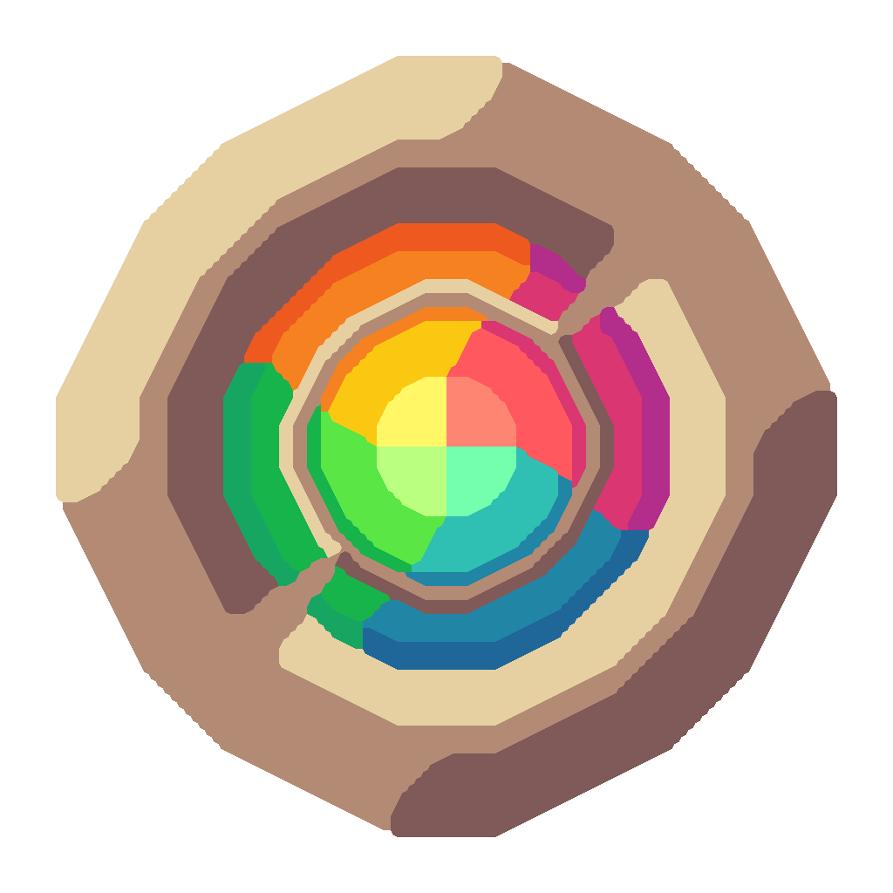

# Mau;engine

</img>

**Mau** - игровой движок для *карточных игр*. Как например Uno, дурак, только с добавлением
множества дополнительных возможностей.
Цель проекта - расширить горизонты карточных игр.

## Семейство Mau
Для полноценной игры одного движка недостаточно, потому представляем вам все
доступные компоненты:

- [Mau;cards](https://github.com/miroqru/mau-cards):
  Сервер-генератор изображений игровых карт.
- [Mau;serve](https://github.con/miroqru/mauserver):
  Web сервер для игрового движка, дополняющий его новыми функциями.
- [Mauren](https://github.com/miroqru/mauren):
  Клиентская библиотека для взаимодействия с сервером Mau.
- [Mau;tg](https://github.con/miroqru/mau-tg):
  Telegram бот для совместной игры в Mau в групповых чатах.

## Компоненты
Вот что входит в движок Mau:

- Колода карт:
  - Поведение карт
  - Игровые карты
  - Колода карт
  - Шаблоны для сборки колоды
- Игровой процесс:
  - Игра
  - Менеджер игроков
  - Игрок
  - Игровые правила
  - Револьвер
- Обработчик событий
- Менеджер сессий
- Хранилище для игр и игроков

## Поддержка проекта
Мы будем очень рады, если вы **поддержите развитие проекта**.
Есть несколько способов как вы можете это сделать:

- Оставить **звёздочку** в репозитории.
- **Играть** вместе с друзьями в Mau.
- **Участвовать в бета-тестировании** новых функций.
- **Предлагать** свои собственные идеи.
- Сообщать о найденных багах или даже предлагать их решение.
- **Сделать** форк проекта.

> Подробности в [документации](https://mau.miroq.ru/docs/use/maintenance)

Нам бы очень хотелось создать **лучшего бота** для весёлой совместной игры с друзьями!

## Благодарности

в начале это был **форк** [Mau Mau bot](https://github.com/jh0ker/mau_mau_bot).
Большое спасибо этому проекту, без него не появилась бы Mau.

И после произошло *чуть-чуть **много** изменений*:
- Переписан на *aiogram*.
- Разделена *архитектура* на бота и движок.
- Добавлены новые *игровые режимы*.
- Система игровых событий.
- С нуля переработанный движок.
- Использование стратегий для карт.
- Генератор колоды.
