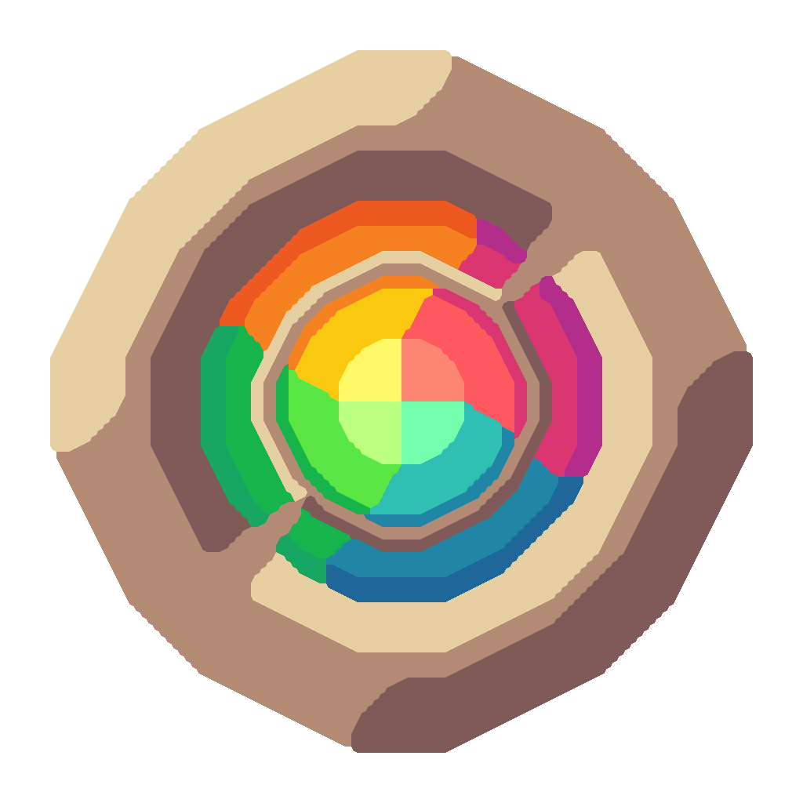

# Mauno; Bat </img>

> Вам нравится Uno? Значит понравится и Mau!

**Mau** - замечательная _карточная игра_, похожая на _Уно_.
в которую вы можете весело поиграть со своими друзьями прямо в Telegram чатах.

**Немного особенностей**:

- 🎮 **Легко** научиться играть
- 🍓 Много необычных и весёлых **игровых правил**
- ☕ Система **Лобби**
- 🌟 Несколько вариантов **колод**
- 📝 **Журнал** игровых событий
- 😊 `Callback` кнопочки и `inline query` к вашим услугам
- 🃏 Красивые нарисованные карточки

> Бот использует `inline query` клавиатуру для карт.
> Будьте готовы что после игры остаётся _море сообщений_ в чате.
> Зато это же так весело!

## Полезные страницы

Если не знаете с чего начать, загляните в раздел начало игры.

- [Начало игры](use/game.md)
- [Команды бота](use/commands.md)
- [Игровые правила](use/rules.md)
- [Семейство Mau](eco.md)
- [Локальная установка](use/install.md)
- [Генератор карт](use/card_generator.md)
- [Поддержка проекта](use/maintenance.md)
- [Документация Mau](./mau/index.md)
